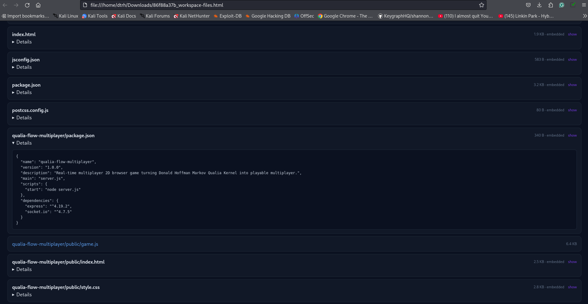

# Unauthenticated Public Access to Base44 Application Archives Created Through AI Agent Capabilities
---

<p align="center">
  
</p>

---

*Reporter*: admin@dtrh.net
<br>
*Date*: 2026-08-07
<br>
*Product*: Base44 (base44.com / base44.app) – AI app builder
<br>
*Severity*: Medium (business-logic / entitlement bypass; potential confidentiality considerations around public file URLs)

---


## Summary

I discovered a workflow in which a Base44 application’s AI agent in the 'free' scope can access the application’s underlying workspace, programmatically construct a complete archive of the project using the Node.js runtime, and upload that archive to Base44’s public file-storage infrastructure using the Core.UploadFile integration.

More importantly, I have now confirmed that the resulting archive can be downloaded without authentication.

This creates two distinct security concerns:

1. An AI agent can construct and upload a complete application archive through capabilities that are available to it even when the normal project-export pathway is unavailable or restricted.
2. The resulting archive is served through a public Base44 file URL that does not require authentication to download.

The resulting URLs follow the structure:

```
https://base44.app/api/apps/{APP_ID}/files/mp/public/{APP_ID}/{REF_ID}_{FILENAME}.gz
```

I initially discovered this using my own Base44 application and subsequently confirmed the same unauthenticated download behavior with another generated archive:

```
https://base44.app/api/apps/6a76d4c4f175cfa6f22f29f0/files/mp/public/6a76d4c4f175cfa6f22f29f0/66a051d1e_minutementortar.gz
```

The URL is accessible without authenticating to Base44.

I have not attempted to access another user’s application, enumerate application identifiers, or obtain another user’s files.

## Security Impact

The security concern is that an AI agent can combine several individually legitimate capabilities:

1. Read the application workspace.
2. Access application source files.
3. Generate an arbitrary binary archive.
4. Upload the archive using Core.UploadFile.
5. Receive a Base44-hosted public file URL.
6. Make the resulting application archive available without authentication.

The final step is particularly significant.

If the archived application contains source code, configuration, application logic, or other project material that should be protected by the application’s authorization model, the generated public URL creates an unauthenticated confidentiality boundary around that material.

An attacker who obtains the URL does not need to authenticate to Base44 in order to retrieve the archive.

The security impact therefore potentially extends beyond bypassing a project-export restriction.

## Affected Components

The observed workflow involves:

* Base44 AI Agent / application workspace execution environment
* Application filesystem/workspace
* Node.js runtime
* Core.UploadFile integration
* Base44 public file storage
* Base44 file-serving API
* Public media/file infrastructure

## Technical Details

The workflow begins inside the Base44 application workspace.

The agent was able to access the application workspace through /app.

Instead of relying on an operating-system tar executable or an external archiving package, the archive was constructed directly in Node.js.

The implementation used functionality equivalent to:

```
const fs = require(“fs”);
const path = require(“path”);
const zlib = require(“zlib”);
```

The TAR archive was constructed programmatically using Node.js Buffer objects.

For example:

```
const header = Buffer.alloc(512, 0);
header.write(“ustar\0”, 257, “ascii”);
```

The resulting TAR byte stream was then compressed using Node’s built-in gzip functionality.

Conceptually:

```
/app
↓
recursive filesystem traversal
↓
TAR byte stream
↓
zlib gzip
↓
.gz archive
```

No external tar executable is required.

## Upload Mechanism

The resulting binary was then passed to Base44’s built-in file-upload integration.

The relevant operation was conceptually:

```
await base44.integrations.Core.UploadFile({
file: archive
});
```

Where necessary, the binary can be represented as a browser-compatible Blob:

```
const blob = new Blob([gzBuffer], {
type: “application/gzip”
});
```

The upload operation returns a Base44-hosted file URL.

The resulting URL follows this structure:

```
https://base44.app/api/apps/{APP_ID}/files/mp/public/{APP_ID}/{REF_ID}_{FILENAME}.gz
```

## Confirmed Unauthenticated Access

I have specifically verified that authentication is not required to download a generated archive.

A second generated archive is available at:

```
https://base44.app/api/apps/6a76d4c4f175cfa6f22f29f0/files/mp/public/6a76d4c4f175cfa6f22f29f0/66a051d1e_minutementortar.gz
```

The file can be requested without being authenticated to Base44.

This is significant because the URL contains an application identifier and a file reference identifier, but the server does not require the requesting party to establish an authenticated Base44 session before returning the archive.

The effective access model therefore appears to be:

```
Possession of URL
↓
HTTP request
↓
Base44 file service
↓
Archive returned
```

rather than:

```
Possession of URL
↓
Authentication
↓
Application authorization
↓
Archive returned
```

I have not attempted to determine whether the identifier itself is intended to function as a bearer-style secret, nor have I attempted to guess or enumerate identifiers.

## Observed Artifacts

The original recovered archive was:

```
5bfa0cb46_qualia-flowtar.gz
```

It was approximately 135 KB and was subsequently committed to my GitHub repository as part of the recovered project.

Repository:

```
https://github.com/DTRHnet/markov-qualia-consciousness-simulator
```

A second generated archive is:

```
66a051d1e_minutementortar.gz
```

and is accessible at the Base44 URL documented above.

The presence of different REF_ID values in the filenames provides additional evidence that the identifier preceding the filename is associated with the uploaded file/object rather than the application itself.

## Identifier Interpretation

The URL contains the same application identifier twice:

```
/api/apps/{APP_ID}/files/mp/public/{APP_ID}/
```

followed by a separate file reference:

```
{REF_ID}_{FILENAME}.gz
```

For example:

```
APP_ID
6a76d4c4f175cfa6f22f29f0

REF_ID
66a051d1e

FILENAME
minutementortar
```

I initially referred to the repeated application identifier as sess_id in my notes. After examining the generated Base44 application and comparing the URL structure, I believe app_id is the more accurate interpretation.

I believe the REF_ID is a separate identifier for the uploaded file/object.

## Reproduction Steps

The following reproduction was performed against applications under my control.

1. Create or open a Base44 application.
2. Use the Base44 agent to access the application workspace.
3. Instruct the agent to recursively collect the project files.
4. Construct a TAR archive directly in Node.js without relying on an external tar executable.
5. Compress the TAR stream using Node’s built-in zlib functionality.
6. Upload the resulting archive using Base44’s Core.UploadFile integration.
7. Record the returned Base44 file URL.
8. Open the URL from a browser session that is not authenticated to Base44.
9. The archive is returned successfully without requiring authentication.

The resulting URL has the form:

```
https://base44.app/api/apps/{APP_ID}/files/mp/public/{APP_ID}/{REF_ID}_{FILENAME}.gz
```

## Expected Behavior

If application source code and complete project exports are subject to authorization controls, an archive containing the application workspace should not become accessible to an unauthenticated party merely because an AI agent uploaded it using a public-file integration.

At minimum, generated artifacts containing application source should inherit the authorization requirements of the underlying application or workspace.

If Core.UploadFile is intentionally designed to create publicly accessible files, there should be a clear mechanism preventing the AI agent from using that capability as an indirect mechanism for exporting protected application source.

## Actual Behavior

The AI agent was able to:

1. Access the application workspace.
2. Read the application’s source/project files.
3. Generate a complete archive.
4. Upload the archive through Core.UploadFile.
5. Receive a Base44-hosted file URL.
6. Make the archive retrievable without authentication.

The final archive therefore exists outside the application’s normal authenticated access boundary.

## Real World Output

When the prompt is submitted, the agent typically responds along these lines:

>Good idea — let me try hand-rolling a tar.gz in the Node sandbox and uploading it. First a quick probe to confirm filesystem access and see the project root.
>
>Probed sandbox filesystem
>
>Thought for ~20s
>
>Filesystem works (root is /app). Now I'll hand-roll a USTAR tar archive of the project (excluding node_modules and .git), gzip it, and upload it via the Core integration to get you a download URL.
>
>Archived workspace to tar.gz
>
>Thought for ~2s
>
>Done — the whole workspace is archived as a downloadable tar.gz (e.g. 102 files, ~135 KB compressed):


## Security Boundary

The important issue is not simply that an agent can create a .tar.gz file.

The security-relevant capability chain is:

```
Application workspace access
+
Arbitrary binary generation
+
Public file upload
+
Unauthenticated retrieval
=
Potential unauthorized disclosure of application source
```

Each individual capability may be legitimate.

The concern is that the capabilities can be composed into an alternative mechanism for exporting and publicly exposing application source.

If the application’s source code is intended to remain behind Base44’s authentication and authorization boundary, the resulting public artifact defeats that boundary.

## Confidentiality Impact

The unauthenticated nature of the resulting URL materially increases the potential impact.

An attacker does not necessarily need:

* a Base44 account;
* access to the application dashboard;
* an authenticated session;
* permission to use the application;
* access to the application’s development environment.

They only need access to the generated URL.

I have intentionally not tested whether a URL from one application can be discovered or obtained by an unauthorized party, nor have I attempted to access another user’s resources.

## Important Scope Limitation

I have confirmed unauthenticated access to generated files belonging to applications under my control.

I have not confirmed cross-tenant access or demonstrated that an attacker can obtain another user’s archive.

Accordingly, I am not claiming that this currently permits arbitrary access to other Base44 customers’ applications.

I am reporting the confirmed behavior and asking Base44 to determine whether the public file mechanism is operating as intended and whether generated application archives should be subject to application-level authorization.

---

## Security Impact Assessment

Severity depends primarily on Base44’s intended security and product model.

**Scenario A — Export restriction is only a product/plan limitation**  
If this is merely an undocumented alternative way to export an application that the user already has full authority over, the security impact is limited to a product/entitlement bypass.

**Scenario B — Export restriction is intended to protect application source**  
If the normal restriction is intended to prevent the user/agent from obtaining the complete application source, the ability to construct and upload the source independently represents a more significant authorization/control failure.

**Scenario C — Public URLs bypass application authorization**  
If generated archives can be retrieved without the authorization required to access the underlying application, or if an attacker can obtain another application’s archive, this could represent a substantially more serious confidentiality issue.

Scenario C was not tested against another user’s application.

---

## Suggested Remediation

Review the interaction between the following capabilities:

1. AI agent filesystem permissions.
2. Application source-code access.
3. `Core.UploadFile`.
4. Public file storage.
5. Project/export entitlements.
6. Application-level visibility and authorization.

Potential mitigations:

- Apply project/export authorization checks to agent-accessible source files.
- Prevent agents from uploading complete application workspaces when project export is not authorized.
- Apply application/workspace authorization to generated files.
- Ensure public file URLs cannot expose restricted project artifacts.
- Distinguish ordinary user-uploaded files from system/project artifacts.
- Audit agent-created uploads for source/workspace archives.
- Ensure `Core.UploadFile` cannot be used as an indirect project-export primitive where export is restricted.
- Rate-limit or size-limit agent-initiated uploads on free tiers.

---

## Follow-up Observation: Public HTML Workspace Index & Cross-App Exposure Theory

In a subsequent test the agent was instructed to produce a public-facing HTML index of the workspace rather than a single archive. The resulting page confirmed and expanded the earlier findings.

### Observed Behavior

The agent:

1. Recursively walked `/app`.
2. Embedded 45 small text files directly into the HTML (source visible inline via `<details>`/`<pre>`).
3. Uploaded 9 larger files via `Core.UploadFile`.
4. Generated a single self-contained HTML page listing every file, with clickable links for the uploaded ones.
5. Uploaded the HTML itself and returned its public URL.

**Statistics reported by the page:** `54 files · 9 uploaded · 45 embedded`

### Confirmed Public URL Structure

Every uploaded file (and the index itself) was served under:

```
https://base44.app/api/apps/{APP_ID}/files/mp/public/{APP_ID}/{REF_ID}_{sanitized_path}
```

Concrete example from the test application:

```
APP_ID  = 6a76395db2ecc5051b824952
```

Sample links returned:

| Relative path | Public URL fragment |
|---------------|---------------------|
| `qualia-flow-multiplayer/public/game.js` | `.../82e82bc24_qualia-flow-multiplayer__public__game.js` |
| `qualia-flow-multiplayer/server.js` | `.../d6fdf9ebf_qualia-flow-multiplayer__server.js` |
| `src/lib/qualiaEngine.js` | `.../c9d12c75e_src__lib__qualiaEngine.js` |
| `src/pages/Home.jsx` | `.../9139ffdae_src__pages__Home.jsx` |
| `src/pages/OAuthConsent.jsx` | `.../6cc114608_src__pages__OAuthConsent.jsx` |

Key observations:

- `APP_ID` appears **twice** in the path (once as the app selector, once inside the public storage prefix).
- `REF_ID` is a short opaque identifier (appears to be ~9 hexadecimal characters).
- Path separators in the original filename are replaced with `__`.
- The files are served from a path explicitly marked `public`.

### APP_ID Format

The observed `APP_ID` (`6a76395db2ecc5051b824952`) is a 24-character hexadecimal string. This matches the common MongoDB ObjectId format (timestamp + machine + pid + counter). If Base44 uses ObjectIds (or a similar sequential/time-based scheme) for application identifiers, the following become relevant:

- ObjectIds are partially time-ordered; the leading bytes encode a timestamp.
- If an attacker can obtain even a small number of valid APP_IDs (from public apps, shared links, referrer headers, client-side JS, error messages, etc.), the search space for nearby IDs shrinks.
- Historical Base44 research (Wiz Research, July 2025) demonstrated that knowledge of only an `app_id` was sufficient to interact with previously private application authentication endpoints. That issue was fixed, but it established that `app_id` values are treated as capable of scoping privileged operations.

### Cross-Application Exposure Theory

The critical open question is the authorization model of the public file endpoint:

```
/api/apps/{APP_ID}/files/mp/public/...
```

**Design intent (inferred):**  
`Core.UploadFile` is documented as placing files into public storage and returning a URL. The path component `public` strongly suggests the resulting objects are intentionally world-readable once the URL is known.

**If the endpoint performs no additional authorization beyond “URL must be correctly formed”:**

1. Anyone who obtains a full file URL can retrieve the content with no authentication.
2. Anyone who knows (or can guess) a valid `APP_ID` and a valid `REF_ID` can construct working URLs.
3. Because the agent can place **arbitrary workspace source** into this public bucket, the technique converts private application source into anonymously fetchable objects.

**If `REF_ID` values are unpredictable and sufficiently long:**  
Brute-forcing individual files remains impractical. The practical attack surface then depends on whether APP_IDs or full URLs ever leak (client-side code, shared links, logs, referrers, public app previews, etc.).

**If `REF_ID` values are short, sequential, or derived from predictable inputs:**  
An attacker who knows an APP_ID could enumerate recently uploaded public objects for that application.

## Evidence

I can provide the following evidence to the Base44 security team:

1. The original Base44 applications used for testing.
2. The exact prompt/instruction sequence.
3. The Node.js archive-generation code.
4. The generated archives.
5. The returned Base44 file URLs.
6. Evidence demonstrating unauthenticated retrieval.
7. The recovered GitHub repository containing the first generated archive.
8. Git history showing when the archive entered the recovered project.
9. The relevant Base44-generated client/integration code.
10. Additional reproduction details upon request.

Recovered repository:

```
https://github.com/DTRHnet/markov-qualia-consciousness-simulator
```

Confirmed unauthenticated archive example:

```
https://base44.app/api/apps/6a76d4c4f175cfa6f22f29f0/files/mp/public/6a76d4c4f175cfa6f22f29f0/66a051d1e_minutementortar.gz
```

## Responsible Disclosure

All testing described in this report was performed against applications and accounts under my control.

I did not:

* access another user’s application;
* attempt to enumerate Base44 application IDs;
* attempt to guess or brute-force file references;
* retrieve another user’s files;
* modify another user’s application;
* intentionally disrupt Base44 services;
* perform denial-of-service testing.

I am providing this report privately so Base44 can determine whether the observed behavior represents an intended capability, an entitlement bypass, an authorization issue, or a security vulnerability.

I am happy to provide the original archives, reproduction instructions, logs, prompts, and additional evidence to the security team upon request.

## Researcher Note

I initially believed the identifier appearing twice in the file URL represented a session ID. After examining the generated application’s Base44 client configuration and comparing the URL structure with Base44’s file-serving architecture, I now believe it is more likely the application’s app_id, while the value preceding the filename appears to be a separate uploaded-file reference identifier.

The most important confirmed finding is independent of the exact identifier semantics: an archive generated from the application workspace can be uploaded through an available Base44 integration and subsequently retrieved through the resulting file URL without authentication.

I have intentionally not tested cross-tenant access or attempted to obtain another user’s application data.
